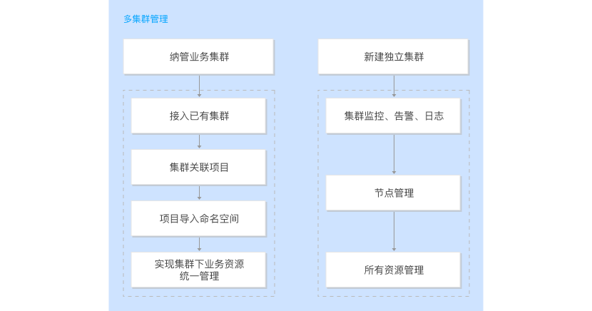

# 应用场景

## 多集群管理
通过平台快速搭建一个基于 Kubernetes 的集群 or 接入一个客户已有的 Kubernetes 集群，统一管理不同云端上的 Kubernetes 集群；满足企业多集群、环境统一管理需求。
多集群可管理不同基础设施环境中的集群和主机，保障了故障迁移，使企业能快速有效并低成本的跨区域、跨平台运行集群。

## DevOps

为企业提供包含需求管理、项目管理、研发、测试、运维等服务在内的开箱即用一站式服务，使软件的构建、测试和发布变得更加快捷、频繁和可靠。缩短开发周期，增加部署频率，实现更可靠的发布。支撑应用的全生命周期，旨在建立一套快速、频繁、稳定地进行构建、测试、发布软件的文化与环境，与业务目标紧密结合。

## 微服务治理

Service Mesh 是基于容器和 Istio 框架的微服务治理平台。平台提供了环境部署、Istio 配置、Istio 监控、应用管理、服务注册发现、服务拓扑、调用链追踪、路由管理、Istio 网关、流量策略、安全策略等服务的开箱即用一站式服务。

## 联邦集群

平台支持将在不同数据中心内的集群组建为联邦集群，可实现应用的异地多活部署。借助联邦集群组网方案，保证了某一集群故障时，可进行应用的灾备切换。联邦集群使企业能快速有效并低成本的跨区域、跨平台运行集群，协助工作负载的不间断运行。

## 统一运维

TKE 企业版提供了业务自身的运维管理能力，满足运维人员的主动监控、异常时的告警通知，以及协助定位解决问题时使用的日志、事件功能模块。提供简单便捷的对接客户内部监控、日志系统的能力，标准规范接口可快速实施落地；也将客户已有的其他业务通过 exporter 快速接入到平台，实现对第三方组件的监控管理。

